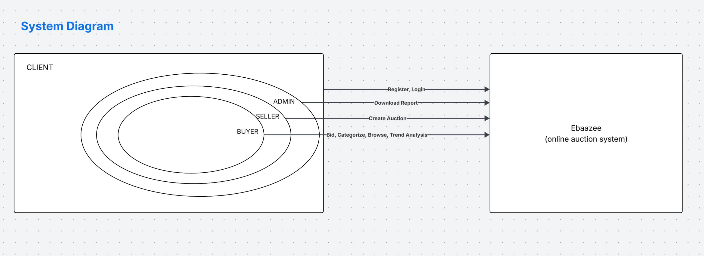
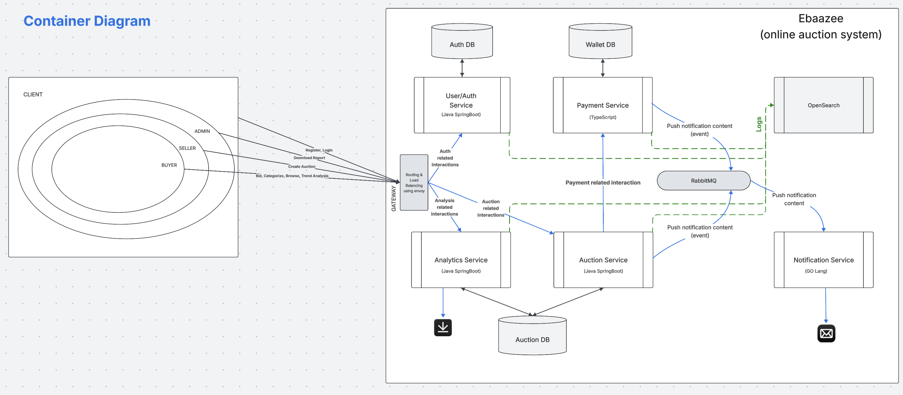

<div align="center">

# Ebaazee - Microservices-Based Online Auction System OSS

</div>

---

## What is Ebaazee?

Ebaazee is a modern, production-ready microservices-based auction platform. It enables real-time bidding, secure payments, automated notifications, and analytics, all orchestrated via an API Gateway. Built for scalability, reliability, and developer friendliness.

---

## Quick Start

### Prerequisites

- Docker Desktop (with Docker Compose)
- Git
- 8GB+ RAM (16GB recommended)

### Run the Complete Stack (Recommended)

```bash
# 1. Clone the repository

cd APIBP-20242YB-Team-01

# 2. Start all services
./run-all.sh
# Or: docker compose up --build

# 3. Access the API Gateway
http://localhost:8080
```

### Stopping Services

```bash
docker compose down
```

---

## System Diagram



---

## Container Diagram



---

## Features

- User authentication & JWT security
- Real-time auction management
- Wallet-based payments
- Email notifications
- Analytics & reporting
- Centralized logging

---

## Documentation & Advanced Usage

For detailed architecture, API docs, troubleshooting, Kubernetes setup, and contribution guidelines, see:

- [docs/PROJECT_OVERVIEW.md](docs/PROJECT_OVERVIEW.md)
- Service-specific docs in `services/*/INFO.MD`
- API Gateway config in `gateway/api-gateway/API-GATEWAY.MD`

---

## License

This project is licensed under the MIT License. See [LICENSE](LICENSE).
#### Download Excel Report (GraphQL - Admin Only)
```bash
curl -X POST http://localhost:8080/api/analytics/v1/graphql \
  -H "Authorization: Bearer $TOKEN" \
  -H "Content-Type: application/json" \
  -d '{
    "query": "query { downloadProductReport(productId: 1) { filename base64Content } }"
  }'

# Expected Response:
# {
#   "data": {
#     "downloadProductReport": {
#       "filename": "product_1_report.xlsx",
#       "base64Content": "UEsDBBQACAgIAAAAAAAAAAAAAAAAAAAAAAAL..."
#     }
#   }
# }
# 
# 💡 Decode base64Content to save as Excel file:
# echo "<base64Content>" | base64 -d > report.xlsx
```

---

## API Endpoints

### User Service (Port 8081 → Gateway: /api/auth, /api/users)

| Endpoint | Method | Description | Auth Required | Role |

## API Endpoints

All API endpoint tables, request/response examples, and details are now maintained in the documentation:

- **See [`docs/ARCHITECTURE_AND_SYSTEM.md`](docs/ARCHITECTURE_AND_SYSTEM.md) for the complete, up-to-date list of all service endpoints, request/response schemas, and usage examples.**

### Tech Stack

| Service | Language/Framework | Database | Key Dependencies |
|---------|-------------------|----------|------------------|
| **User Service** | Java 21, Spring Boot 3.5 | PostgreSQL 15, Redis 7 | Spring Security, JWT (io.jsonwebtoken), Spring Data JPA, Lombok |
| **Auction Service** | Java 21, Spring Boot 3.5 | PostgreSQL 15 | Spring Data JPA, Spring Scheduling, RabbitMQ, Lombok, Validation API |
| **Payment Service** | Node.js 20, TypeScript 5 | PostgreSQL 15 | Express.js, pg (PostgreSQL), Opossum (circuit breaker), amqplib |
| **Notification Service** | Go 1.22 | - (Stateless) | net/smtp, RabbitMQ client (amqp091-go), dotenv |
| **Analytics Service** | Java 21, Spring Boot 3.5 | PostgreSQL 15 (shared with Auction) | Spring GraphQL, Apache POI (Excel), Spring WebFlux, Lombok |

### Infrastructure & DevOps

| Component | Technology | Version | Purpose |
|-----------|-----------|---------|---------|
| **API Gateway** | Envoy Proxy | v1.27 | HTTP routing, load balancing, circuit breaking, retries |
| **Databases** | PostgreSQL | 15 | Persistent data storage (3 isolated instances) |
| **Caching** | Redis | 7 | Session management, JWT token storage, rate limiting |
| **Messaging** | RabbitMQ | 3 (Management) | Event-driven communication, async processing |
| **Logging** | OpenSearch | 2.x | Centralized log storage, search, and analysis |
| **Log Aggregation** | Fluent Bit | Latest | Collect logs from Docker containers → OpenSearch |
| **Visualization** | OpenSearch Dashboards | 2.x | Log visualization, monitoring, alerting |
| **Containerization** | Docker, Docker Compose | Latest | Service orchestration, deployment |

### Security & Monitoring

- **Authentication:** JWT (RS256/HS256), Spring Security 6, bcrypt password hashing
- **Authorization:** Role-based access control (BUYER, SELLER, ADMIN)
- **API Security:** Envoy rate limiting, request validation, CORS configuration
- **Data Security:** PostgreSQL role-based access, encrypted connections
- **Logging:** Structured JSON logs via Fluent Bit → OpenSearch cluster
- **Monitoring:** OpenSearch Dashboards for real-time log visualization
- **Health Checks:** Built-in health endpoints for all services

---

## Key Features

### Authentication & Authorization
- JWT-based authentication with access + refresh tokens
- Role-based access control (BUYER, SELLER, ADMIN)
-  Password hashing with BCrypt (strength: 12 rounds)
-  Redis-backed session management
-  Secure HTTP-only cookies for token storage
-  Token refresh mechanism (automatic renewal)
-  OAuth 2.0 ready architecture

###  Auction Management
- Product catalog with hierarchical categories
- Auction lifecycle management (PENDING → ACTIVE → CLOSED → COMPLETED)
- Concurrent bid handling with optimistic locking
- Scheduled tasks for automatic status updates (Spring @Scheduled)
-  Real-time bid validation (minimum increment, timing, user eligibility)
-  Reserve price protection
-  Data loader for sample data (dev-db profile)
- WebSocket support for real-time updates

###  Payment Processing
- Wallet-based payment system (balance + locked funds)
-  Fund locking mechanism for active bids
-  External payment gateway integration (simulated)
-  Circuit breaker pattern for reliability (Opossum)
-  Transaction history and audit trail
- RabbitMQ event publishing (payment.locked, payment.success, payment.failed)
-  Automatic fund release for outbid users
-  Payment reconciliation

### Notifications
- Email notifications via SMTP (Gmail integration)
-  RabbitMQ event consumption (fan-out exchange)
-  Support for multiple event types:
  - Bid placed
  - Auction won
  - Payment confirmation
  - Payment failed
-  Configurable SMTP settings via environment variables
-  Email templating system
- Retry logic for failed deliveries

###  Analytics & Reporting
-  REST API for basic analytics (top bidders, popular auctions)
-  GraphQL API for complex queries and aggregations
- Excel report generation (Apache POI) with base64 encoding
-  Real-time statistics computation
-  Top bidders and popular auctions tracking
-  Revenue analytics and trend analysis
-  Auction performance metrics
- Data visualization-ready APIs

###  Logging & Monitoring
- Centralized logging with OpenSearch cluster (2-node)
-  Automatic log aggregation with Fluent Bit
-  OpenSearch Dashboards for visualization
-  Structured JSON log format
-  Service-specific log levels (DEBUG, INFO, WARN, ERROR)
-  Request/response logging
-  Performance metrics tracking
-  Error tracking and alerting-ready

---

##  Deployment

### Docker Compose Architecture

```yaml
Infrastructure Layer:
  ├── auth-db (PostgreSQL:5433)
  ├── auction-db (PostgreSQL:5434)
  ├── wallet-db (PostgreSQL:5435)
  ├── redis (Redis:6379)
  ├── rabbitmq (RabbitMQ:5672, Management:15672)
  ├── opensearch-node1 (OpenSearch:9200, 9600)
  ├── opensearch-node2 (OpenSearch - clustered)
  ├── opensearch-dashboards (Dashboards:5601)
  └── fluent-bit (Log aggregation)

Application Layer (via Gateway:8080):
  ├── envoy (API Gateway:8080, Admin:9901)
  ├── user-service (Internal:8081)
  ├── auction-service (Internal:8082)
  ├── payment-service (Internal:8081, External:8086)
  ├── notification-service (Internal:8080, External:8083)
  └── analytics-service (Internal:8085)

Data Flow:
  Client → Envoy Gateway → Microservices → Databases
           ↓
  RabbitMQ (Events) → Notification Service
           ↓
  Fluent Bit → OpenSearch Cluster → Dashboards
```

---

### Deployment Commands

```bash
#  Start all services
./run-all.sh
# Or: docker compose up --build

#  Start specific services
docker compose up user-service auction-service payment-service

#  View logs (all services)
docker compose logs -f

#  View logs (specific service)
docker compose logs -f user-service

#  Check running containers
docker compose ps

#  Stop all services
docker compose down

#  Stop and remove volumes (deletes all data)
docker compose down -v

#  Restart a service
docker compose restart user-service

# Rebuild specific service
docker compose up --build user-service

#  Clean up unused resources
docker system prune -a --volumes
```

---

### Service Health Monitoring

```bash
# Check all services health
docker compose ps

#  View resource usage
docker stats

# Access OpenSearch Dashboards
open http://localhost:5601

# Access RabbitMQ Management UI
open http://localhost:15672
# Default credentials: guest/guest

#  Access Envoy Admin Interface
open http://localhost:9901

#  Check logs in OpenSearch
# 1. Go to http://localhost:5601
# 2. Navigate to "Discover"
# 3. Create index pattern: fluent-bit-*
# 4. Filter by kubernetes.container_name or log_level

#  Monitor RabbitMQ Queues
# 1. Go to http://localhost:15672
# 2. Login with guest/guest
# 3. Navigate to "Queues" tab
# 4. Check: payment-service-consumer, notification-queue
```

---

##  Troubleshooting

### Issue: Services won't start

```bash
# Check logs for errors
docker compose logs <service-name>

# Common fixes:
# 1. Restart the service
docker compose restart <service-name>

# 2. Rebuild the image
docker compose up --build <service-name>

# 3. Check for port conflicts
lsof -i :<port-number>
kill -9 <PID>

# 4. Clean Docker cache
docker system prune -a
```

---

### Issue: Database connection failures

```bash
# Check if databases are running
docker compose ps auth-db auction-db wallet-db

# View database logs
docker compose logs auth-db

# Restart databases
docker compose restart auth-db auction-db wallet-db

# Verify database is accepting connections
docker exec -it <db-container> psql -U <username> -d <database>
```

---

### Issue: RabbitMQ connection errors

```bash
# Restart RabbitMQ
docker compose restart rabbitmq

# Check RabbitMQ logs
docker compose logs rabbitmq

# Wait 30-60 seconds after startup for RabbitMQ to fully initialize

# Verify RabbitMQ is ready
curl http://localhost:15672/api/overview
# Login: guest/guest
```

---

### Issue: Port already in use

```bash
# Find process using port
lsof -i :8080

# Kill the process
kill -9 <PID>

# Or change port in docker-compose.yml
# ports:
#   - "8090:8080"  # Use 8090 instead
```

---

### Issue: Out of memory errors

```bash
# Check Docker memory allocation
docker stats

# Increase Docker memory:
# Docker Desktop → Settings → Resources → Memory: 8GB+

# Or reduce running services:
docker compose up envoy user-service auction-service payment-service

# Stop unused services:
docker compose stop notification-service analytics-service
```

---

### Issue: Builds failing (Java services)

```bash
# Common Maven issues:

# 1. Clear Maven cache in container
docker compose down
docker volume prune

# 2. Check JDK version in pom.xml
# Should be: <java.version>21</java.version>

# 3. Build locally to verify
cd services/user-service
./mvnw clean package

# 4. Ensure Docker can pull Maven image
docker pull maven:3.9.4-eclipse-temurin-21
```

---

### Issue: Payment service fails to build

```bash
# TypeScript compilation issues:

# 1. Install dependencies locally
cd services/payment-service
npm install
# Or: pnpm install

# 2. Verify tsconfig.json exists
cat tsconfig.json

# 3. Build locally to test
npm run build

# 4. Ensure Dockerfile installs dev dependencies
# Should have: RUN npm install (not npm install --production)
```

---

### Issue: Email notifications not sending

```bash
# Configure SMTP credentials:

# 1. Create .env file in project root
cat > .env << EOF
SMTP_USER=your-email@gmail.com
SMTP_PASS=your-app-password
EOF

# 2. For Gmail, create an App Password:
# https://myaccount.google.com/apppasswords

# 3. Restart notification service
docker compose restart notification-service

# 4. Check logs
docker compose logs -f notification-service
```

---

### Issue: OpenSearch not starting

```bash
# Common OpenSearch issues:

# 1. Increase vm.max_map_count (Linux/macOS)
sudo sysctl -w vm.max_map_count=262144

# 2. Make it permanent
echo 'vm.max_map_count=262144' | sudo tee -a /etc/sysctl.conf

# 3. Restart OpenSearch
docker compose restart opensearch-node1 opensearch-node2

# 4. Check OpenSearch logs
docker compose logs opensearch-node1

# 5. Verify OpenSearch is up
curl http://localhost:9200
```

---

##  Additional Resources

### Service-Specific Documentation
- [User Service README](services/user-service/INFO.MD)
- [Auction Service README](services/auction-service/INFO.MD)
- [Payment Service README](services/payment-service/INFO.MD)
- [Notification Service README](services/notification-service/INFO.MD)
- [Analytics Service README](services/analytics-service/INFO.MD)
- [API Gateway Configuration](gateway/api-gateway/API-GATEWAY.MD)

### OpenAPI Specifications
Located in `api-specs/` directory:
- [User Service API](api-specs/user-service.yaml)
- [Auction Service API](api-specs/auction-service.yaml)
- [Payment Service API](api-specs/payment-service.yaml)
- [Notification Service API](api-specs/notification-service.yaml)
- [Analytics Service API](api-specs/analytics-service.yaml)

### Configuration Files
- [Envoy Gateway Config](gateway/envoy/envoy.yaml)
- [Docker Compose](docker-compose.yml)
- [Fluent Bit Config](fluent-bit.conf)
- [Log Parsers](parsers.conf)

---

## Security Best Practices

### Production Deployment Checklist

#### Authentication & Authorization
- [ ] Change default JWT secret (use 256-bit key)
- [ ] Implement token rotation policy
- [ ] Set appropriate token expiration (access: 15min, refresh: 7 days)
- [ ] Enable MFA for admin accounts
- [ ] Implement account lockout after failed attempts

#### Database Security
- [ ] Change all default database passwords
- [ ] Use strong passwords (16+ chars, mixed case, symbols)
- [ ] Enable SSL/TLS for database connections
- [ ] Implement database user role separation
- [ ] Enable audit logging
- [ ] Regular backup schedule (automated)
- [ ] Encrypt backups at rest

#### API Security
- [ ] Enable HTTPS/TLS for all services (Let's Encrypt)
- [ ] Configure CORS policies (whitelist domains)
- [ ] Implement rate limiting (e.g., 100 req/min per user)
- [ ] Add request size limits (prevent DoS)
- [ ] Enable API versioning (/api/v1/, /api/v2/)
- [ ] Implement request signing for service-to-service calls
- [ ] Add IP whitelisting for admin endpoints

#### Messaging & Events
- [ ] Enable SASL/SSL for RabbitMQ
- [ ] Create RabbitMQ user with limited permissions
- [ ] Use separate queues per service (isolation)
- [ ] Implement message encryption for sensitive data
- [ ] Set message TTL (time-to-live)
- [ ] Enable dead-letter queues for failed messages

#### Logging & Monitoring
- [ ] Enable OpenSearch authentication
- [ ] Change default OpenSearch admin password
- [ ] Implement log retention policy (e.g., 90 days)
- [ ] Set up alerting for critical errors
- [ ] Implement audit logging for sensitive operations
- [ ] Use structured logging (JSON format)
- [ ] Sanitize logs (remove sensitive data like passwords, tokens)

#### Infrastructure
- [ ] Use environment variables for all secrets
- [ ] Implement secrets management (HashiCorp Vault, AWS Secrets Manager)
- [ ] Enable Docker Content Trust (image signing)
- [ ] Run containers as non-root users
- [ ] Use read-only file systems where possible
- [ ] Implement network segmentation (separate backend/frontend networks)
- [ ] Enable container resource limits (CPU, memory)

#### Application Security
- [ ] Implement input validation (all endpoints)
- [ ] Use parameterized queries (prevent SQL injection)
- [ ] Enable CSRF protection
- [ ] Implement file upload restrictions (type, size)
- [ ] Sanitize user-generated content (prevent XSS)
- [ ] Add security headers (HSTS, X-Frame-Options, CSP)
- [ ] Regular dependency updates (npm audit, OWASP Dependency-Check)

#### Compliance & Auditing
- [ ] Implement GDPR compliance (data deletion, export)
- [ ] Log all access to sensitive data
- [ ] Implement user consent management
- [ ] Regular security audits (quarterly)
- [ ] Penetration testing (before production launch)
- [ ] Maintain security incident response plan
- [ ] Regular backup testing (recovery drills)

---

##  Contributing

We welcome contributions from the community! Please follow these guidelines:

### Getting Started
1. Fork the repository
2. Create a feature branch: `git checkout -b feature/your-feature-name`
3. Make your changes
4. Write/update tests
5. Ensure all tests pass
6. Commit with meaningful messages
7. Push to your fork
8. Open a Pull Request

### Code Style

#### Java Services
- Follow [Google Java Style Guide](https://google.github.io/styleguide/javaguide.html)
- Use Lombok annotations (@Data, @Builder, etc.)
- Document public APIs with Javadoc
- Keep methods under 50 lines
- Use meaningful variable names

```java
// Good
@Data
@Builder
public class UserDto {
    private Long id;
    private String email;
    private String name;
}

// Bad
public class UserDto {
    public Long i;
    public String e, n;
}
```

#### Node.js/TypeScript
- Use TypeScript strict mode
- Follow [Airbnb JavaScript Style Guide](https://github.com/airbnb/javascript)
- Use async/await (avoid callbacks)
- Use ES modules (import/export)
- Document functions with JSDoc

```typescript
// Good
export async function getUserById(id: string): Promise<User> {
    const user = await db.findUser(id);
    if (!user) throw new NotFoundException();
    return user;
}

// Bad
exports.getUser = function(id, callback) {
    db.findUser(id, function(err, user) {
        callback(err, user);
    });
};
```

#### Go Service
- Follow [Effective Go](https://go.dev/doc/effective_go)
- Use `gofmt` for formatting
- Use meaningful package names
- Handle errors explicitly

```go
// Good
func sendEmail(to string, subject string, body string) error {
    if err := smtp.SendMail(config); err != nil {
        return fmt.Errorf("failed to send email: %w", err)
    }
    return nil
}
```

### Commit Messages
Follow [Conventional Commits](https://www.conventionalcommits.org/):

```
feat(user-service): add password reset endpoint
fix(payment): resolve wallet balance lock issue
docs(readme): update API endpoint documentation
chore(deps): upgrade Spring Boot to 3.5.1
test(auction): add integration tests for bidding
refactor(analytics): improve query performance
```

### Pull Request Guidelines
- **Title:** Use format `[ServiceName] Brief description`
- **Description:** Clearly explain what and why
- **Link Issues:** Reference related issues (`Closes #123`)
- **Tests:** Include unit/integration tests
- **Documentation:** Update README and API specs if needed
- **Screenshots:** For UI changes (if applicable)
- **Breaking Changes:** Clearly mark and explain

### Testing Requirements
- Unit tests for new features
- Integration tests for API endpoints
- Minimum 70% code coverage
- All tests must pass before merge

---

##  License

This project is licensed under the **MIT License** - see the [LICENSE](LICENSE) file for details.

```
MIT License

Copyright (c) 2025 APIBP-20242YB-Team-01

Permission is hereby granted, free of charge, to any person obtaining a copy
of this software and associated documentation files (the "Software"), to deal
in the Software without restriction, including without limitation the rights
to use, copy, modify, merge, publish, distribute, sublicense, and/or sell
copies of the Software, and to permit persons to whom the Software is
furnished to do so, subject to the following conditions:

The above copyright notice and this permission notice shall be included in all
copies or substantial portions of the Software.

THE SOFTWARE IS PROVIDED "AS IS", WITHOUT WARRANTY OF ANY KIND, EXPRESS OR
IMPLIED, INCLUDING BUT NOT LIMITED TO THE WARRANTIES OF MERCHANTABILITY,
FITNESS FOR A PARTICULAR PURPOSE AND NONINFRINGEMENT.
```

---

## 👥 Team

**APIBP-20242YB-Team-01**  
BITS Pilani - API-Based Product Development Course

### Contributors
This project is built by students as part of the **API-Based Product Development** course at BITS Pilani.

<a href="https://github.com/BITSSAP2025AugAPIBP3Sections/APIBP-20242YB-Team-01/graphs/contributors">
  
</a>

---

### Resources
- **GitHub Issues:** [Report bugs or request features](https://github.com/BITSSAP2025AugAPIBP3Sections/APIBP-20242YB-Team-01/issues)
- **API Gateway:** `http://localhost:8080`
- **OpenSearch Dashboards:** `http://localhost:5601`
- **RabbitMQ Management:** `http://localhost:15672` (guest/guest)
- **Envoy Admin:** `http://localhost:9901`

### Common Commands
```bash
# Start everything
./run-all.sh

# Check health
curl http://localhost:8080/api/users/health

# View logs
docker compose logs -f

# Stop everything
docker compose down
```

---

<div align="center">

### Building Scalable Auction Platforms with Microservices

**Version:** 1.0.0  
**Status:** Production Ready  

Built with ❤️ by Team 01

[⬆ Back to Top](#-ebaazee---microservices-based-auction-platform)

</div>
